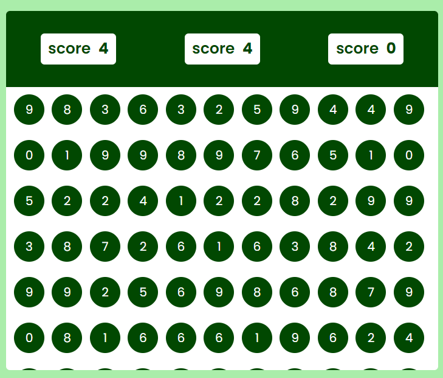

# 🎯 Bubble Game – JavaScript Project

This is a fun and interactive **Bubble Game** created using **HTML, CSS, and JavaScript**.  
Click on the bubbles that match the "hit" number before the timer runs out!

---

## 🚀 Features

- 🎈 Random bubbles generated every round  
- 🎯 Click the correct number to score points  
- ⏱ Countdown timer  
- 📱 Responsive design for all devices  
- ⚡ Real-time DOM updates  

---

## 🧰 Technologies Used

- **HTML** – for structure  
- **CSS** – for styling the game interface and bubbles  
- **JavaScript** – for functionality and logic (random numbers, timer, scoring, DOM updates)

---

## 📸 Screenshot

> Game UI Preview  
  
*Make sure to save a screenshot of your game as `screenshot.png` in the root folder.*

---

## ▶️ How to Play

1. Open `index.html` in your browser.  
2. You’ll see a **HIT number** on top.  
3. Click the bubble with that number.  
4. If you’re right, your **score increases by 10** and a new set of bubbles appears.  
5. The game ends when the timer hits **0**.

---

## 📚 What I Learned

This was a great learning project for DOM and event handling in JavaScript.  
I learned:

- `Math.random()` and `Math.floor()` for generating random numbers  
- Using `addEventListener` for handling click events  
- Working with `innerHTML`, `textContent`, and class selectors  
- Updating the DOM dynamically based on logic  
- Using `setInterval()` and `clearInterval()` for game timers  

---

## 🌱 Future Plans

- 🎵 Add sound effects  
- 🧠 Add difficulty levels  
- 🔁 Restart game button  
- 🏆 Save and show high score

---

## 🔗 Connect with Me

- 💻 GitHub: [codezenashish](https://github.com/codezenashish)  
- 📷 Instagram: [@codezenashish](https://www.instagram.com/codezenashish/)

---

> Made with ❤️ using pure HTML, CSS, and JavaScript.
