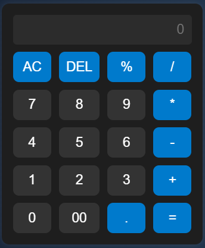

# Simple Calculator – JavaScript Project

This is my first project using **HTML, CSS, and JavaScript**.  
It’s a basic calculator that can perform simple arithmetic operations like addition, subtraction, multiplication, and division.

---

## Features
- User-friendly UI
- Supports basic operations: +, –, ×, ÷
- Responsive design (works on mobile too)
- Keyboard input support (optional)
- Clean layout with modern look

---

## Technologies Used
- **HTML** – structure of the calculator  
- **CSS** – for styling and layout  
- **JavaScript** – for functionality and logic

---

## Screenshots
> *preview*  

---

## How to Use
1. Open `index.html` in your browser  
2. Click on the number and operation buttons  
3. See the result instantly in the display area

---

## Learning Experience
This was my first JavaScript project.  
I learned:
- How to handle user input
- Writing functions for logic
- Connecting buttons with event listeners
- Updating the DOM dynamically

---

## Future Plans
- Add keyboard support  
- Add percentage & square root features  
- Improve styling with animations

---
## Connect

- Instagram: [@codezenashish](https://www.instagram.com/codezenashish/)
- GitHub: [codezenashish](https://github.com/codezenashish)

