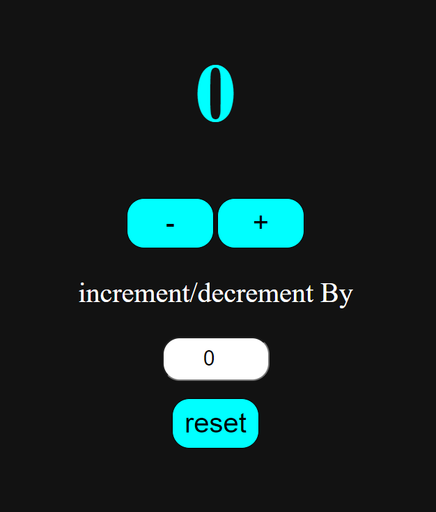

# 🧮 Counter App – JavaScript Project

A modern **Counter App** built using **HTML, CSS, and JavaScript** with a sleek **dark theme UI**.  
It features interactive controls to increase, decrease, or reset the count, along with a custom input to change the count dynamically.

---

## 🔥 Features

- ➕ **Increment Button**
- ➖ **Decrement Button**
- 🔁 **Reset Button**
- 🔢 **Custom Input** – Enter any number to add/subtract dynamically
- 🌙 **Dark Theme UI**

---

## 🛠️ Technologies Used

- **HTML** – Page structure  
- **CSS** – Stylish dark-themed design  
- **JavaScript** – Functional logic and DOM manipulation

---

## 🖼️ Screenshots

> *App Preview*  

---

## 🚀 How to Use

1. Open the file `index.html` in your browser  
2. Click `+` to increase the count  
3. Click `-` to decrease the count  
4. Click `Reset` to set the count back to 0  
5. Use the input box to set a custom value to add/subtract

---

## 📚 What I Learned

- DOM manipulation using JavaScript  
- Event handling for buttons  
- Dynamic value updates using input  
- Styling a UI in dark mode  
- Improving user experience with interactivity

---

## 🔗 Connect With Me

- 📸 Instagram: [@codezenashish](https://www.instagram.com/codezenashish/)
- 💻 GitHub: [codezenashish](https://github.com/codezenashish)
