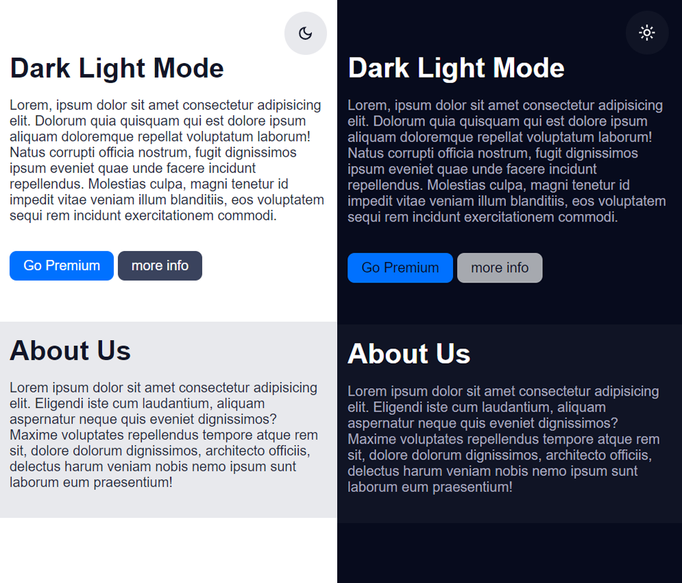

# 🌗 Dark & Light Mode Toggle – JavaScript Project

A sleek and responsive **Dark & Light Mode** toggle web page built with **HTML, CSS, and JavaScript**.  
It provides a modern UI switch that remembers your preferred theme using `localStorage`.

---

## ✨ Features

- 🌞 Light Mode UI  
- 🌙 Dark Mode UI  
- 💾 **Remembers theme** using `localStorage`  
- 🎨 Smooth color transitions  
- ⚡ Theme toggle button with icon switch  
- 📱 Fully responsive design  

---

## 📸 Screenshot

> *Live Preview of UI with Theme Toggle*  

---

## 🛠️ Technologies Used

- **HTML** – Page Structure  
- **CSS** – Custom properties (CSS Variables) for theming  
- **JavaScript** – Toggle logic and `localStorage` for saving preferences

---

## 🚀 How to Use

1. Clone or download the repo.
2. Open `index.html` in your browser.
3. Click the theme toggle button (top-right corner) to switch themes.
4. Refresh the page — your theme preference stays saved!

---

## 📚 What I Learned

- How to use CSS custom properties (`--variables`)  
- How to manipulate the DOM using JavaScript  
- Persisting user preferences with `localStorage`  
- Building a theme toggle system with icons and transitions

---

## 🔗 Connect With Me

- 📸 Instagram: [@codezenashish](https://www.instagram.com/codezenashish/)
- 💻 GitHub: [codezenashish](https://github.com/codezenashish)

