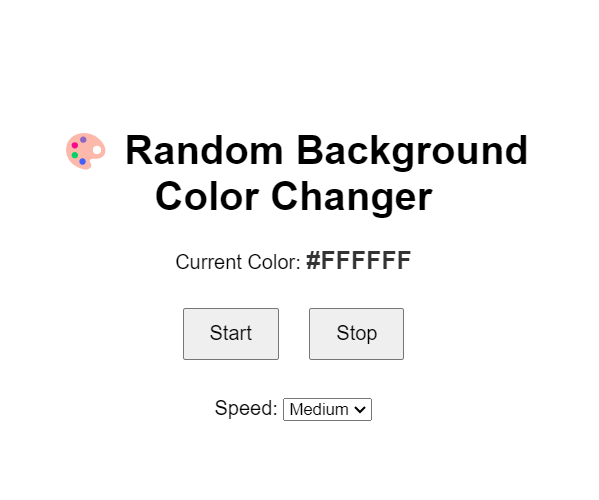

# 🎨 Random Background Color Changer

This is a simple and fun JavaScript project that changes the background color of the webpage to a random HEX color at different speeds. You can **Start**, **Stop**, and **Control the speed** of the color changes, and it also shows the **current HEX code** on the screen.

---

## ✨ Features

- 🎯 Random background color every few seconds
- 🎛️ Speed control: Slow, Medium, Fast
- 🎨 HEX color code display in real-time
- 🖱️ Start & Stop functionality
- 🌐 Fully responsive and easy to use

---

## 📷 Preview

>

---

## Connect

- Instagram: [@codezenashish](https://www.instagram.com/codezenashish/)
- GitHub: [codezenashish](https://github.com/codezenashish)