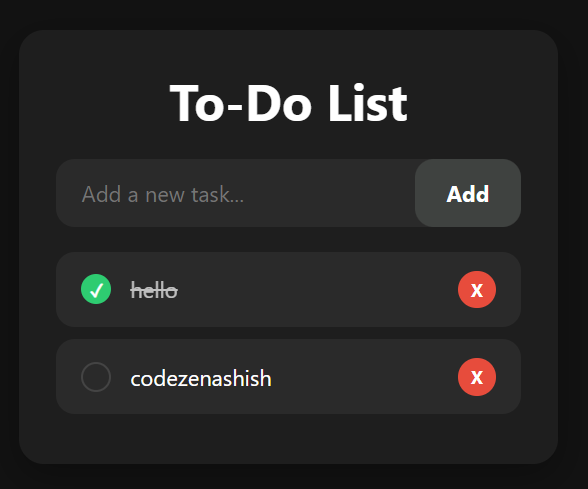

# To-Do List – JavaScript Project

This is a beautiful **To-Do List App** built using **HTML, CSS , and **JavaScript**.  
It has a **dark theme**

---

## Features
- Add, delete, and mark tasks as completed
- Dark mode 
- Persistent data using `localStorage` (optional)
- Responsive design – mobile friendly

---

## Technologies Used
- **HTML** – layout structure  
- **CSS** – modern styling  
- **JavaScript** – task logic and DOM manipulation

---

## Screenshots
> *Preview*  

---

## How to Use
1. Open `index.html` in your browser  
2. Type a task and click **Add**  
3. Click the checkbox to mark as done  
4. Use delete icon to remove task

---

## Learning Experience
In this project, I learned:
- Handling dynamic DOM elements
- Working with arrays to manage tasks

---

## Future Plans
- Add `localStorage` support to save tasks  
- Add drag-and-drop to reorder tasks  
- Add filters: All / Completed / Pending  
- Add sound or animation feedback on actions

---

## Connect

- Instagram: [@codezenashish](https://www.instagram.com/codezenashish/)
- GitHub: [codezenashish](https://github.com/codezenashish)
